# CPSC324: Big Data Analytics

## How to Read Research Papers

1. **READING FOR A PURPOSE**
  * for us to understand basic idea, approach, assumptions, trade-offs
2. **READ IN MULTIPLE PASSES** (easier to understand)
  * First: title, section titles, figures/captions/tables
  * Second: Abstrat (mini-paper)
    * problem, why important, solutions/approach, results
    * focus on approach and results
  * Third: Full read
    * active w/ notes (use style that you prefer)
    * often in phases
      * into up to (not including) evaluation
      * checkpoint
      * eval to conclusion
3. **PUSH THROUGH TOUGH/CONFUSING PARTS**
  * good skill: hold content w/o understanding
    * usually that content will become clearer at a later time

## Course Introduction

> **Goal #1:** Cover underlying ideas of "modern" data & analytics systems

* systems span entire data & processing "life cycle"
    * how to get data into the system
    * how to deal with different kinds of data
    * how to query data
    * how to process data
* focus on stability as data, processing, users, and uses increased
* this goal will be achieved through the reading assignments in the course
* *scalability:* if more resources gain same/similar performance increases
  * EX: handle 2x the data if we add 2x computers
  * EX: 10x faster with 10x CPUs
  * scale-out (scale horizontally): increasing the number of machines (computers? what is a machine?)
  * scale-up (scale vertically): increasing the "power" of a machine (more RAM, more disk, more CPUs, etc.)

> **Goal #2:** Hands-on experience using systems

* in the context of this class, this means cloud computing
* this will be achieved through HW assignments on Google Cloud Platform (GCP)

### Course Title: Big Data Analytics

* really should be called "data engineering for data science"

#### What Does Analytics Mean?

* *descriptive analytics:* find patterns in data and gather a larger understanding of the data you are currently ingesting
  * EX: total energy usage by month over the last 2 years
* *diagnostic analytics:* why?
  * EX: relationships between monthly energy use and utilization

> descriptive and diagnostic analytics are examples of **business intelligence**

* *predictive analytics:* using historical/current data to predict what happens next (essentially a guessing game)
  * typically while doing this we are generating a model
  * EX: energy use for next year by month given expected utilization
* *proscriptive analytics:* use predictive models to take action or make decisions
  * EX: using the model, delay requests to reduce demand on local grid energy
  * something similar done in Google data centers

## Data Architecture

### What Does Big Data Mean?

* **big data:** implies a relative measure of the data storage and processing
  * implies that we can't do the "normal" approach and rather need to do something drastically different
* WAYS THAT DATA CAN BE BIG
  * Volume: overall amount
  * Variety: different types/formats of data
  * Velocity: amount generated... streaming/real-time related
* CHARACTERISTICS OF BIG DATA
  * Value: data is useful to help your goals
  * Veracity: quality/correctness of the data
* In this class, we will cover high-level data platform architectures and then drill down a bit to see components/tasks

### Data Platform Architecturesxit

**TRADITIONAL DATA WAREHOUSE ARCHITECTURE:**

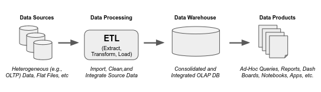

  * mostly for structured data sources
  * ETL (Extrat, Transform, Load) takes considerable effort (DUDE, IT'S HARD)
  * systems mainly used on-premise servers
  * scalability becomes tricky and expensive (partitioning, load-balancing, etc.)
  * many DMBSs 20+ years ago not designed for large "scale-out"
    * typically these designs were meant to be scsaled vertically NOT horizontally
  * harder to use with data increases (type) & uses (ML...)
    * you would need a different architecture for real-time/streaming data

**CURRENT TWO-TIER DATA ARCHITECTURES:**

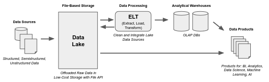

* supports data variety through file-based data storage (*data lake*)
* decouples ETL transform step from extract and load
* better supports wider range of analytical processing
* assumes scale-out performance, decouple storage and compute
* everything is stored on the cloud, which completely takes advantage of the ability to scale-out
* according to [Armbrust], widely used including Fortune 500 companies

### An Outline of this Class and Google's Architecture

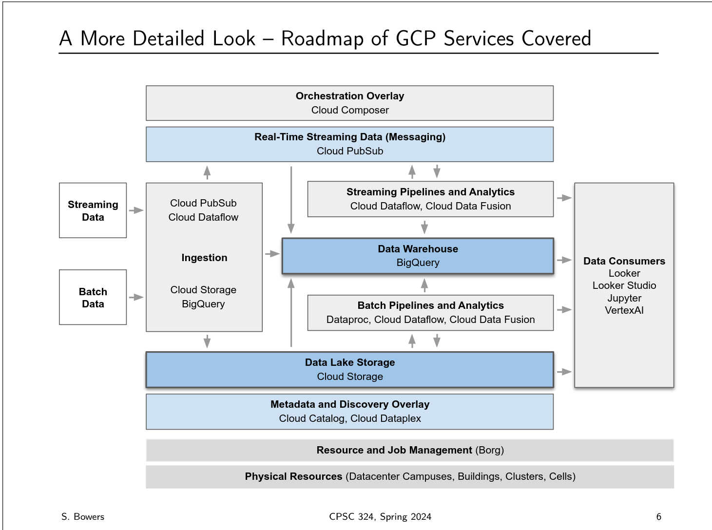

* Google Cloud Platform: similar to the data lake, just general file storage for throwing data into
* Google Big Query: the data warehouse - where all the data is formalized and cleaned to be stored and queried by other data professionals
* ETL VS ELT
  * ETL: Extract, Transform, Load: data is transformed before it is saved anywhere
  * ELT: Extract, Load, Transform: data is loaded into the data lake as is, then when people want the data they come back to translate the data
* data lake: there to just batch store data, especially useful for data that is being streamed continuously over time

## Machines, Networks, Properties

### Machines

* **machine abstraction:** computers as (simplified) devices containing:
  * 1+ processors (CPU)
  * RAM
  * disk storage as HDD or SSD
  * network connection
* **server:** generally software that provides a service to clients
  * often used interchangeably with machine running server software
* **commodity-class:** lower-cost machines, standard "off-the-shelf" components
* **server-class:** higher-cost machines, high speed/high-capacity components

### More on Memory

* **memory hierarchy:** from small-fast to large-slow
  * registers: within CPU, smallest and fastest
  * L1, L2, L3 Cache: within CPU, increasing size/decreasing speed
  * RAM: on motherboard, much larger in size
  * Flash: non-volatile, storage medium, e.g. on the motherboard
  * Disk: non-volatile, storage device, SSD then HDD, often "removable"
* cache memory helps reduce time from RAM to registers
  * fetches contiguous block of memory into L1, L2, L3
  * if CPU needs data not in cache, results in a **cache miss**
  * exploits the notion of **data locality** (e.g. think array access)

### Many Machines

* **server rack:** physical rack holding multiple computers/devices
  * devices in rack-mountable cases
  * slot heigh in rack unit $\mu=1.75$ inches
* **network packets:** consist of data (payload) and destination
* **hub, switch, router:** for moving packets
  * hub: forwards packets to all machines connected
  * switch: forwards packets to appropriate machine
  * router: directs traffic between networks
* **network topology:** structure of connections, e.g. tree-like and mesh
* **data center:** collection of racks, devices connected forming networks
  * can be separate space in a building, an entire building, or many buildings
* **google data centers:** 14 in US, 6 in Europe, 3 in Asia, 1 in Chile
  * 10s of machines per rack, stacked in rows, 1 or more rows form a *cluster*
  * a cluster contains 10k+ machines (aka cluster *nodes*)
  * building holds multiple clusters, campus (site) has multiple buildings
* **load balancer: distributes network traffic to balance resource use**
  * for replicated resources (e.. same services running over many machines)
  * a separate device or software (server) that dynamically routes to a replica
* **remote procedure call (RPC):** a program "calls" procedure on another node
  * protocol handles details, including data passing (serlialization)exit
  

## GCP Basics and System Properties

* To use the coupons you need to log in with your Zagmail account and choose the *Google Workspace Account* option
  * you know it worked if you get re-directed to SSO

### Main Ways to Interact with GCP Services

1. **cloud console:** a GUI that lets you click and select all the options that you want
2. **CLI:** from your local machine or through the *cloud shell*
  * cloud shell lets you open a shell in the browser with everything installed for you
3. **programmatically via the SDK:** we will use the Python one but there are many languages that are supported with this
4. **Cloud REST APIs:** not the best way to interact, we will not learn how to use this tool in this class

### GCP Regions & Zones

* manyl cloud platforms have geolocation information that is important when managing your cloud computing
* a **region** is a geoprahic area consisting of 3 more more zones
  * our closest region is `us-west-1` (the Orgeon region)
* a **zone** is hosted in one more more *clusters* (in a data center) but these zones move around and depend on your organization
  * zones are considered *single-failure-domain* because there is a chance that zones can fail

### Data Sizes

* **byte:** 8 bits
* **kilobyte (kB):** 1000 bytes
  * kilo = $10^3$ (so 1000 in base10)
  * kibi = $2^10$ (1024 base2)
  * when dealing with memory it is with kibi, but when talking about volumes of data we mean traditional SI units 
* **megabyte (MB):** 1000 kB
  * 1MB = 1,000,000 bytes
  * mebibyte - base 2 notion
* **gigabyte (GB):** 1000 MB
  * 1GB = 1,000,000,000 bytes
  * gibibyte - base 2 notion
* **terabyte (TB):** 1000 GB
* **petabyte (PB):** 1000 TB
* **exabyte (EB):** 1000 PB
* **zetabyte (ZB):** 1000 EB

### GCP Compute Engine

* Provide *"on-demand"* VMs
  * on-demand: always available and you pay $ when the VM is on
    * this is called *provisioning*

#### Classes of Google VMs

* E2: 2 & 32 vCPUs
  * each vCPU has 4 GiB of RAM
  * no local storage
  * costs roughly $2\cent$ per vCPU per hour
  * costs roughly $0.003\cent$ per GiB RAM per hour
* N2: 2 to 128 vCPUs
  * each vCPU has 4 GiB of RAM
  * has local SSD option
  * costs roughly $3\cent$ per vCPU her hour
  * costs roughly $0.004\cent$ per GIB RAM per hour
 
### Data Movement

* Memory $\leftright$ CPU
* Memory $\leftright$ Disk
  * this is much more expensive!
* machine $\leftright$ machine
  * network cost

### Throughput, Bandwidth, Latency

* **throughput:** actual amount of data transmitted per time unit
* typically bits (bps) or MB per second (Mbps)
* analogy: stand at a point on the freeway
  * *throughput:* number of cars that pass by you per unit time
  * *speed:* average speed of the cars that pass you
* $\therefore$ throughput deals with amount and NOT distance
* **bandwidth:** maximum possible throughput
* bandwidth improves by adding more infrastructure
* freeway analogy: increase lanes, speed, distance between cars
* **latency:** delay in time it takes to get from A to B
* similar to *response time*
* latency is measured in time
  * software: seconds
  * disk/network: ms
  * memory: $\mu$s

> when building applications we want high throughput and low latency

> **CHECK-IN: Why can we have high bandwidth but poor latency?**
> * physical distance
> * congestion
> * processing time is not optimized

#### Latency Values Every Software Dev Should Know

* CPU registers < 1 ns
* L1, L2, L3 Cachee: 1-10 ns
* RAM: 100ns
* SSD: roughly 16,000 ns
* HDD: roughly 2,000,000 ns

#### Bandwidth (Download) Values Every Software Dev Should Know

* Cable (coaxial): 1 Gbps (1 Gigabit per second)
* 5G: typically up to 1 Gbps
* Fiber (consumer) network: up to 10 Gbps 
* Within a Google Data Center: 1 Tbps (1 Terabit per second)
* Across Data Centers: 6 Pbps (1 Petabit per second)
* Check out Jupiter for more info on how Google achieves these high speeds

### General System Terms

* **utilization:** percent usage
  * the goal is high utilization - you don't want your computers sitting there doing nothing
* **reliability (durability):** related to probability of failure over time (what is the likelihood that your system is going to fail?)
* **fault tolerance (resiliency):** either replication or having logs so that the system can recover
* **availability:** the fraction of time that something is available
  * measured in terms of "Number of Nines"
    * 1 9 = 90%
    * 2 9s = 99%
    * 3 9s = 99.9%
    * 1 9-5 = 95%
    * 2 9-5 = 99.5%
* **error budget:** allowed downtime for your system
  * 90% = 6 minutes
  * 99% = 36 seconds
  * 99.5% = 18 seconds
  * 99.9% = 3 seconds
  * 99.99% = 0.36 seconds

## Cluster Management

* **service:** functionality, used by cients, well-defined interface
* service oriented architecture divides system into distinct services
* *"as a service"*: a service offered by a 3rd party (in the cloud)
  * don't have to purchase, manage, use hardware/software "on premises"
* **fully managed:** automated privision, user, server management, pay for machine/resource usage (close to IaaS)
* **serverless:** automated provisioning but figures out your server management and figures out how many resources you actually need based on your activity (close to PaaS)
 
### Various Types of "As a Service"

* IaaS: infrastructure as a service - providing access to physical resources as a service
* PaaS: platform as a service - stuff you need for developing apps (DBMS, web servers, some machine learning tech, etc.)
* SaaS: software as a service - software written by companies that you can access remotely as a service

### GCP Building Blocks

* Google internal & cloud services run on 3 main services
  1. borg: cluster job manager
  2. colossus (cfs): distributed file storage
  3. spanner: distributed transactional database system
* these systems need to have these similar patterns
  * scalability: many machines, data partitioning (sharding), parallel execution
  * replication: for fault tolerance and availability
  * coordination: centralized components in the architectures to manage the parallel workers
  * consistency: concurrency control
  * placement: manage cost of communication

 ### About Borg

> **BORG:** job scheduling (cluster)

* long running jobs: jobs that are never shut down
    * short lived, latency sensitive requests
* batch jobs: take a few seconds or days to run
* each job consists of one or more tasks
    * each task runs in a container
    * supports job sequencing
    * each job runs in a single cell (part of a cluster)
* jobs and tasks can have resource constraints
* jobs are assigned a priority (production and non-production - but there's 450+ priority levels!)

#### Main Functions of Borg

* Given a particular task, figure out which machine to run the task on
* allocate the resources for the task to complete
* installs all the dependencies
* monitors task health (is the task still running? did the task fail? etc.?)
* restart the job upon failure
* (...also implicitly runs the task)

#### Borg Design

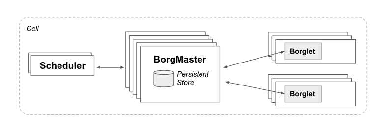

* Borgmaster: centralized controller
    * each cell has a borgmaster (5 replicas)
    * handles client requests
    * each replica stores state info of the cell
    * one leader (elected)
    * accepts job requests where new jobs are added to a *pending queue* (tasks)
    * polls borglets every few seconds to retrieve state and send requests
    * delegates communication to Borgmaster replicas (the "link shard")
    * state information is aggregated (as diffs) and sent to the leader
* Scheduler: asynchronously scans pending queue
    * determines how to assign tasks to machines
    * scheduling has two parts: *feasibility* and *scoring*
        * **feasibility checking:** find machines with enough resources to run the task; includes lower priority task eviction
        * **scoring:** ranks the feasible machines
            * minimizes eviction
            * checks if the dependencies are already installed
            * "packing" quality - need to have room for resources if jobs end up needing more compute power, but spreading out too far leads to fragmentation
* Borglet: local "worker" agent running on each machine
    * starts, stops, restarts tasks
    * manages resources and does logging
    * reports state back to the Borgmaster (plural - remember that there are duplicates!)
* *Notes on task evictions:*
    * apps on Borg expected to be designed to handle evications
        * do this with replication, persistent state stored in distributed file systems
        * taking (occasional) checkpoints
        * Borg automatically reschedules evicted tasks
* This system as 99% availability using spreading tasks around machines, racks, power domains, and keeping each cell independent

## Distributed File Systems

### Background Info

#### File I/O

* disk drives read/write data by sector (often 512 bytes)
    * this means they read/write "chunks" of data at a time
* OSs read/write data by block (similar to a hardware page)
    * blocks are multiples of sector sizes (on linux, 1 block = 4 KiB)

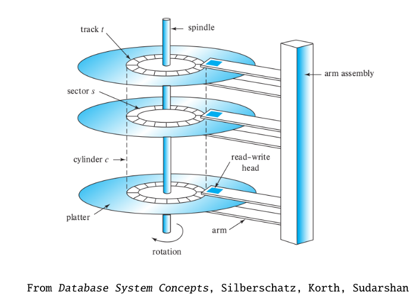

#### Strong Consistency

* **Consistency:** *Assumptions (the "setup up")...*
    * assume a physically distributed, replicated data store
    * means each machine has a copy of the entire store
    * clients read/write data at a replicated copy
    * write opreations are propagated to the other copies

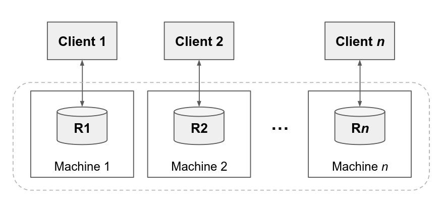

* **Strong Consistency:** All clients see the same data store
    * if client reads a data item, expects result to include last write of them
        * tricky without global clock and/or when operations overlap
    * typically implies *lineralizability* - concurrent execution as if:
        1. linear order of operations
        2. if `op1` completes before `op2` begins, `op1` preceeds `op2` in linear schedule
* EXAMPLE: Alice and Bob write at the same time: $W_A(x=0)$ and $W_B(x=1)$
    * as if all replicas agree on operation ordering, so all replicas have the same $x$ value
    * means subsequent reads will be consistent $R_A(x) = R_B(x)$
    * NOTE: This is a write-write conflict, but can also have read-write conflicts
* There are many different notions of consistency
    * e.g. serializability in transactional databases
    * where linearizability is a specific case for transactions having one operation
    * also continuous, casual, etc.
* Example of weaker consistency: **eventual consistency**
    * one writes stop, all replicas will eventually be consistent
* GFS has its own specific (weaker) flavors of consistency, but more on that to come ...

### Google File System (GFS) Overview

* GFS as a *high-level* is:
    * A distributed storage system, read/write access to large shared files
    * Provides support for data-intensive applications (large files)
    * automatic fault tolerance, high performance (for main operations)

* GFS *was designed for:*
    * Google's commodity clusters where component failures are the norm
    * large files (by traditional standards)
    * files mostly changed by appending and NOT overwriting (e.g. `MapReduce`)
        * multiple clients append concurrently, large sequential writes
    * files mostly read sequentially, either
        * large streaming reads (1MB+) from same client
        * small random reads (few KB) often batched and sorted by apps

### GFS Architecture Overview

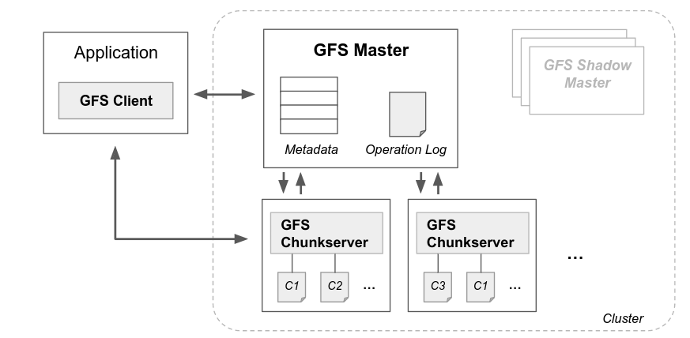

* **GFS Master:** single centralized control, one per cluster
* **GFS Chunkserver:** one per machine, manages file partitions ("chunks")
* **GFS Client:** library running on each application (app can be in cluster)

### Clients and Client Operations

* Applications interact with GFS through a *client library*
    * files can be organized into directories identified by path names
    * can create, delete, open, close, read, write files
    * can also create a *snapshot* copy of a file or directory tree
* We often just say **client** instead of a client library
    * there is a fair bit of work that goes on behind the scenes
* GFS also supports **record append** operation
    * multiple clients can append data concurrently
    * GFS guarantees append is atomic (atomicity)

### Chunks

* **chunk:** large, fixed-size partition of a file
    * each chunk is 64 MB (similar to disk block but much larger)
    * each chunk is assigned a unique identifier called a **chunk handle**
* each chunk stored as a *linux file*
    * replicated on multiple chunk servers, 3 replicas (default)
* advantages of large chunk size:
    * reduces network communication cost (e.g. to get chunks)
    * reduces size of metadata stored in master

### Master

* Master stores 3 types of metadata
    * file, directory, chunk info (namespaces) - logged
    * for each file, the list of chunk handles - logged
    * for each chunk handle, locations of each chunk's replicas
* Read Op: client wants to read data from a dyte offset in a file
    * client uses byte offset (with chunk size) to determine chunk index
    * client sends master a read request with filename and chunk index
    * master returns handle and chunkservers with replicas ... cached by client
    * client sends request to one of the chunkservers (e.g. closest one)
        * request has chunk handle and byte range in chunk
    * chunkmaster returns the data to the client
        * future requests don't need to contact master (until cache expires)
* Heartbeats: periodically sends messages to chunkservers
    * gives instructions and collects chunkserver state
* operation log: historyical record of metadata changes
    * stored locally and remotely (thus, master state replication)
    * state changes committed only after being flushed to log and replicas
* checkpointing: to save space in the operation log
    * whenever log grows beyond certain size, master checkpoints internal state
    * efficiently stored (serialized), direct "memory dump", local and remote
    * if master fails, loads last checkpoint (efficient)
    * then "replays" the operation log file
    * polls chunkservers for their state (to recreate chunk mapping)

### Data Append

* Two cases for data mutations (updates vs append)
    * update: client has filename, dyte range, buffer of write data
    * append: client has filename, buffer of data to append
* Basic Idea: Append
    * each chunk replica is mutated (default 3 replicas per chunk)
    * master selects one **primary** replica (others become secondary replicas)
    * primary is granted a 60 second lease that can be extended if needed
    * during the lease, primary manages chunk changes
    * primary picks a serial order for all chunk mutations
    * second replicas follow the same order when applying mutations

### Record Append

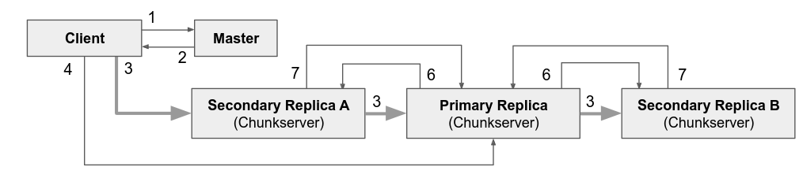

APPEND PROCESS: Assume P is primary and S is secondary

1. client asks master for P and S's (assigns P and lease if needed)
2. master replies with P and Ss (cached for future mutations)
3. client sends data to all replicas (pipelined to closest, who forwards, etc.)
4. after client receives receipt, sends write request to P
    * P orders all changes it receives (across clients), applies changes in order
5. P forwrads write request to S's who apply mutations in same order as P
    * P also tells S's where to write the data in the chunk
6. S's reply to P indicating they completed mutation
7. P replies to client either success or error...

#### Replica Write Failures

* IF one or more replicas fail, writes "stick" at P and non-failing S's
* Client retires steps 3-7 a few times, then retires write with master
* A successful retry can lead to repeated data at some replicas
* Note that all append operations are at the same offset across replicas
* On successful append, client is sent the offset of appended data

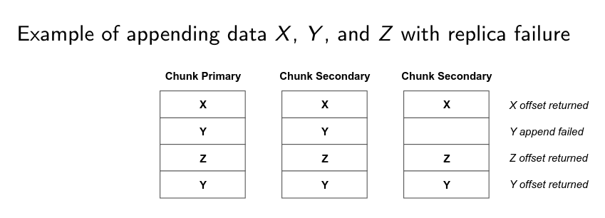

#### Guarantees and Non-Guarantees

* Between appended data, could be padding or append-data duplicates
* the in-between regions are considered inconsistent
* clients see same regions resulting from sequence of successful mutations
* replicas versioned by master when granting leases (for available replicas)
* because clients cache chunk locations, can read from stale replicas
* concurrent non-append writes not guaranteed to be serializable

## `MapReduce`

### Intro

* `MapReduce`: a programming model for simplifying data-intensive computing
    * computations split into a **Map** phase and a **Reduce** phase
    * programmers implement Map and Reduce interfaces
* `MapReduce` framework then handles the overall execution
    * distribution/replication, parallelization, data movement, and failures
* `MapReduce` led to the open-source Apache Hadoop system
    * similar ideas also still used for data-intensive systems
    * e.g. in serverless, auto-scaling, "no-ops" systems
* Inspired by `map()` and `reduce()` functions in functional programming
* `map: function, list -> list` (unary function)
    * `map(f, [a,b,c]) => [f(a), f(b), f(c)]`
* `reduce: function, list -> value` (binary function)
    * `reduce(+, [1,2,3,...]) => (1+2+3+...)`
    * similar to `fold()`, which implements an accumulator pattern
* the input key-value pairs are those produced by the map workers
* one `Reduce` instance per key
* `Reduce` can return more than one value per key
* EXAMPLE: Document word frequency
    * `Map(doc_id, contents) -> (word, 1) pairs`
    * `Reduce(word, count iterator) -> (word, sum(counts))`
* EXAMPLE: Inverted index
    * `Map(doc_id, contents) -> (word, doc_id) pairs`
    * `Reduce(word, doc_id iterator) -> (word, [doc_id])`

### Architecture

* Application, Library, and (GFS) Input File
    * `MapReduce` sets up the input and starts the computation
    * library partitions the input files into $M$ splits (parameter)
    * Notes with GFS, each split is a chunk (i.e. up to 64 MB)
* Worker Assignment 
    * library submits the `MapReduce` job (recall Borg)
    * worker tasks divided into $M$ map tasks, $R$ reduce tasks, 1 master
    * master assigns workers as mappers or reducers
        * mapper = `Map()` task
        * reducer = `Reduce()` task, can perform many reduce tasks
    * tries to assign mappers to same machine as split (a chunk replica)
* Map Task Workers (execute Map function, handle input/output data)
    * read corresponding (input file) split, parse into key-value pairs
    * passes ecah such pair to user-defined `Map()` function
    * intermediate key-value pairs produced stored in memory
    * periodically stored on local disk, one file per reducer
* Map Task Output Files
    * output keys are partitioned across reducers using a Partition Function
    * default uses hash codes $hash(key) \mod R$
    * you can define your own partition function if you would like!
        * EX: to partition on a URL, we can make our own partition function that just hashes on the domain name
* **Data Shuffling:** Map worker notifies Master where its local output files are located, and the Master then notifies the Reducer on the file locations
  * from there, Reducer uses RPC calls to read the kv-pairs in Mapper files
* **Reduce Task Workers:** Reducer waits until all intermediate data has been read, then **sorts** all intermediate kv-pairs by key, groups kv-pairs by key, then runs the reduce function for each group
  * each Reduce function cal''s output is appended to final output file which is stored in GFS
  * Output files often passed as input to another MapReduce job

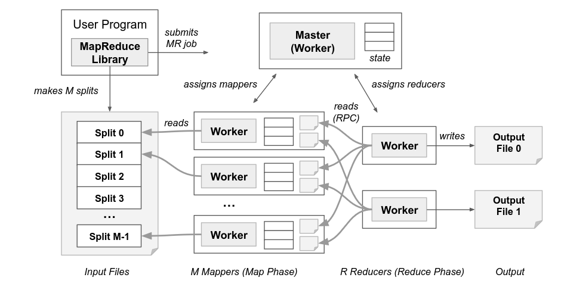

### Fault Tolerance

* The Master worker finds failures
  * master periodically pings workers
  * Machines (workers) that don't respond are considered "failed"
* In-progress tasks on failed workers
  * Map and Reduce tasks on failed workers are rescheduled
  * Master failure requires entire job to be restarted
* Completed tasks on failed workers
  * reducer tasks are fine because output is stored in GFS
  * Mapper tasks rescheduled since no access to output files
* Reduce tasks are notified of failed workers (to read from restarted Mapper)

### Data Mining and Machine Learning Examples

* Many standard ML algs can be converted to MapReduce
  * many follow statistical query pattern
  * expressed as sums applying functions over data points
  * also shown to scale linearly

#### k-means

* Goal is to divide data (rows) into $k$ clusters (partitions)
* $k$-means compute the fixed-point of the cluster centroids

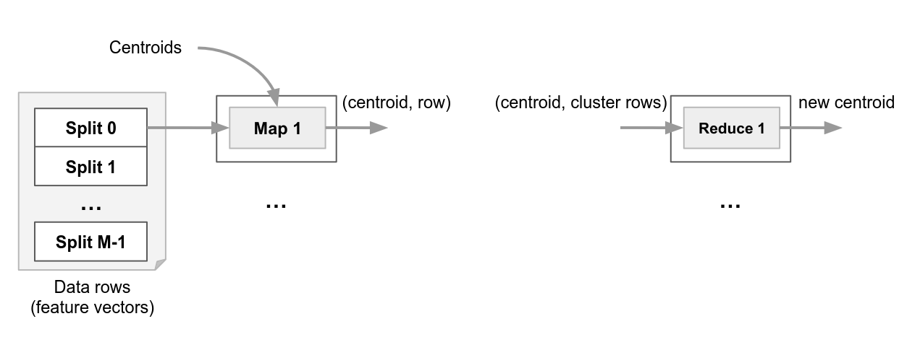

#### Naive Bayes

* uses probability estimates for instance classification
* $P(\ell | \bar x)$ is probability of a row (feature vector) $\bar x$ has class label $\ell$
* Goal is to find the label $\ell_i$ that maximizes $P(\ell | \bar x)$

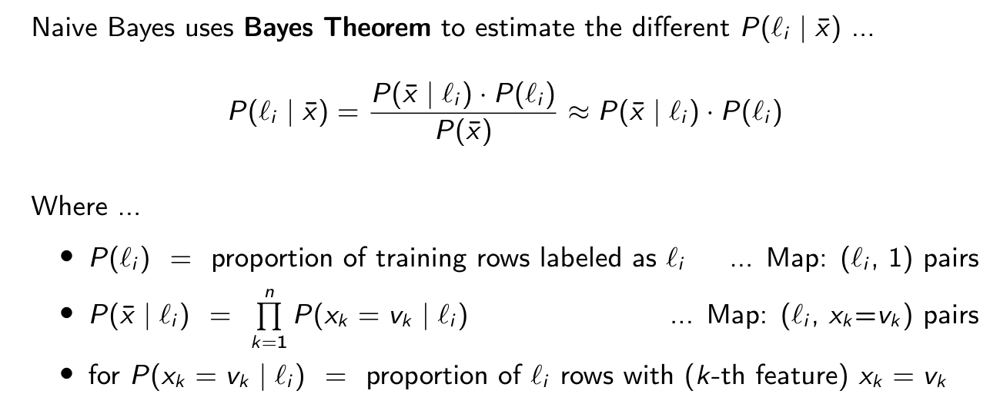
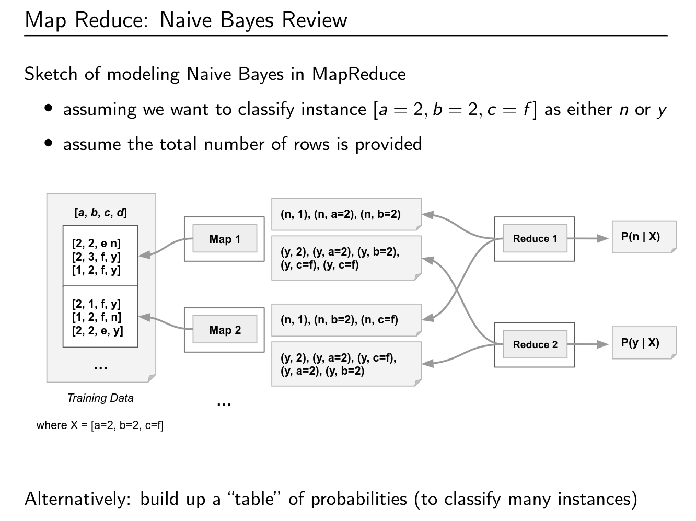

## Looker Studio/Data Warehouses

* **LOOKER STUDIO:** full featured, cloud-native visulaization tool (in GCP)
* primarily used for creating interactive reports and dashboards
* similar to Tableau and Power BI
* works over BigQuery plus various other data sources
* auto converst visualizations to real-time SQL queries
* Looker Studio Pro: "enterprise" paid versions of Looker Studio that has additional features and support

### Basic Terminology

* **Measures:** (*mertics*) values of the "facts" or "observations" in a data warehouse
    * eg: number of items sold and purchase price of each transaction
    * the attributes that would go in a SQL aggregate query
* **Dimensions:** provide context for the facts - the things that we are measuring
    * e.g. customer, product, location, time
    * attributes that would go in a `GROUP BY` clause

> In Looker Studio: "*metrics* measure *dimensions*"

* **Star Schema:** Every dimension that is in a fact table has its own table with foreign key relations (the shape ends up looking like a star because the fact table becomes the centroid)
* **Snowflake Schema:** Take your star schema and normalize your dimension tables
    * as you walk the path towards the fact table, you lose more "facts" (get finer grained)
* **Roll Up** (*Drill Up*): Aggregating at coarser grainularity
    * e.g.: avg sales by city to avg. sales by state
* **Drill Down:** Aggregating at finer granularity
    * r.g. avg sales by state to avg. sales by city
> Roll up and Drill down are inverses - they go in the opposite directions of each other
* **Slicing:** Filtering on a single dimension
* **Dicing:** 2 or more dimensions
* **Pivot:** rotating a table on an attribute
    * basically doing a `GROUP BY` on one column, and whatever those groups are become the attributes in the new table
    * usually the values in a pivot table are aggregate information
* **Looks:** standalone visualization
    * *Explorer:* build various different Looks
* **Dashboard** (aka *Reports*): multiple visualizations, plots, formatting, text, etc.
    * *Controls:* GUI components you can add to the dashboard to make your report more interactive
    * any Look is automatically interactive (can hover over and click data points/bars/etc and get information)

## Data Processing Architectures

### Types of Data Systems

#### Centralized Data Systems

* built to run on a single machine (one CPU, memory, disk)
* all data resides on a single machine
* single user or multiple users
* still used frequently in enterprise systems
* doesn't really scale... in order to scale you really need to "juice up" your machine

#### Parallel and Distributed Systems

* **parallel:** machines are close together and the communication cost is fast and reliable (don't have to worry about networking speed)
* **distributed:** nodes may not be close and the communication is slower and less reliable (you have to worry about network costs now)
* *course-grained parallelism:* each CPU runs a different query
  * improves throughput
* *fine-grained parallelism:* each CPU runs a portion of the query
  * improves latency

#### Architectures based on what resources are shared

* *shared everything:* same as single node centralized system
  * CPUs, memory, disks all shared
  * can still leverage some parallelism if multiple CPUs/cores...
    * focus is on *course-grained parallelism*
* *shared memory:* many processors share same memory
  * implies high-end servers
  * most data systems are not built for this
* *shared nothing:* each node is a separate machine with NO shared storage
  * nodes contain partitions
  * each node works on its own partition
  * centralized machine (master) that manages data processing
  * this was the prevailing model for distributed querying for 30+ years (including many commercial products)
* *shared disk:* machines in a cluster have access to all the same disks 
  * local storage, but it is just used for temporary space for computation, so each machine is effectively stateless

> **A Note on Partitioning:** sometimes partitioning is called "sharding"
> 
> * *naive partitioning:* each table fits on a different node (usually the bad approach)
> * *vertical partitioning:* create partitions out of the columns of a table - this happens in normalization (kinda...)
>   * queries that only focus on a single column are sped up
> * *horizontal partitioning:* splits rows into distinct partitions in a round-robin format
>   * can also use data ranges or hashing to figure out the partitions
>   * PROBLEM: If we scale, we have to stop the system and re-partition everything to accommodate for having more machines - similar to a shuffle in MapReduce

## Query Execution and Handling

### Tables Stored in Files

* e.g. one file per table
* each file is divided into pages (these pages are a little bit bigger than a disk page) ... recall file i/o
* multiple of disk pages/hardware pages
  * Oracle uses 4KB, PorstgreSQL uses 8KB, MySQL uses 16KB
* Heap File: has a header file with a directory page with metadata on where each page starts (in the form of pointers)
* Clustered Index: heap file, but all the rows across all pages are sorted on a search key
* Hash Table: search keys hashed to pages
* B+ Tree: pages stored in a tree-like format (look up more on this in the notes)
* Row oriented storage: have a slotted page, anytime you add a row you add it from the bottom
  * top of the page has header and slots that have pointers showing the start of each row (helps us figure out where rows start)
  * appending if very nice! just addd a row from the bottom and a slot pointer from the top
  * removing a row sucks because you have to shift information around in the file